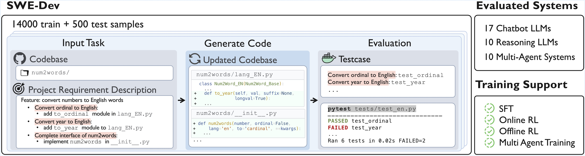

# 💻 SWE‑Dev: Evaluating and Training Autonomous Feature‑Driven Software Development

[](https://justlittlewhite.github.io/SWE-Dev/)
[](https://arxiv.org/abs/2505.16975)
[](LICENSE)
[](https://www.kaggle.com/datasets/dorothydu/fdd-bench)
[](https://hub.docker.com/repository/docker/dorothyduuu/swe-dev/general)

> 🎯 **SWE‑Dev** is the **first large‑scale benchmark and training corpus** for **feature‑driven development (FDD)** — the real‑world task of adding new functionality to existing codebases.
> It ships **14 000 training** and **500 test** tasks, each with a **runnable environment** and **developer‑written unit tests**, enabling both *supervised fine‑tuning* and *reinforcement learning from executable rewards*.



---

## ✨ Highlights

* 🌍 **Real‑world FDD tasks** drawn from mature open‑source projects.
* ⚙️ **End‑to‑end reproducibility** – every task bundles source, deps, Dockerfile & tests.
* 🤖 **RL‑ready** – deterministic pass/fail reward signals from pytest.
* 💪 **Challenging** – Claude‑3.7‑Sonnet reaches only **22.45 % Pass\@3** on the *hard* split.
* 📈 **Effective for model improvement** – fine‑tuning a 7 B model on SWE‑Dev yields GPT‑4o‑level performance on hard split.

---

## 🚀 Getting Started

### 1. 🛠️ Installation

```bash
conda create -n swe-dev python=3.12.0

# bleeding‑edge
git clone [https://github.com/DorothyDUUU/SWE-Dev-dataset.git](https://github.com/DorothyDUUU/SWE-Dev-dataset.git)
cd SWE-Dev-dataset
pip install -r requirements.txt

```bash
conda create -n swe-dev python=3.12.0

# bleeding‑edge
git clone https://github.com/DorothyDUUU/SWE-Dev-dataset.git
cd SWE-Dev-dataset
pip install -r requirements.txt
```
### 2. 📥 Download the dataset & Build evaluation enviornment
**Download dataset:**
```bash
python dataset/download_data.py --dest ./data
```

The script organises the dataset as:
```
data/
 ├── train/
 │   ├── level1/
 │   ├── level2/
 │   └── level3/
 └── test/
     ├── Easy/
     └── Hard/
```

**Docker Installation:**
Train set and test set are originated from different packages, thus the packages are installed in different docker images.

Test docker: (Need at least 10GB storage space for docker image)
```bash
python download_docker.py --split test
```
Train docker: (Need at least 100GB storage space for docker image) 
```bash
python download_docker.py --split train
```

**Build evaluation API:**
For further usage for RL training, we wrapped the docker test in an API server, which could conviniently build in latter use.

### 3. ⏱️ Quick Inference
**Single Agent Inference**
If you want to test on your own model, you can use the following command:
```bash
bash SWE-Dev-dataset/infer/single/run.sh
```

**Multi-Agent Inference**
We also integrate 10 Multi-Agent Systems inference in the [MASLab](https://github.com/MASWorks/MASLab) framework for SWE-Dev Dataset. Please refer to `infer/MAS/README-MAS.md`.

| No. | Methodology                                                                                     | Venue        | Role    | Topo.   | Tool | Generalization    |
|:---:|:------------------------------------------------------------------------------------------------|:------------:|:-------:|:-------:|:----:|:-----------------:|
| 1   | [Reflexion](https://arxiv.org/abs/2303.11366)                                                   | NeurIPS 2023 | Fixed   | Fixed   | No   | Yes               |
| 2   | [Self-Consistency](https://arxiv.org/abs/2203.11171)                                            | ICLR 2024    | Fixed   | Fixed   | No   | Yes               |
| 3   | [LLM Debate](https://arxiv.org/abs/2305.14325)                         | ICML 2024    | Fixed   | Fixed   | No   | Pre-defined Roles |
| 4   | [MAD](https://arxiv.org/abs/2402.18034)                       | EMNLP 2024   | Fixed   | Fixed   | No   | Pre-defined Roles |
| 5   | [Self-Refine](https://arxiv.org/abs/2303.17651)                                                  | NeurIPS 2024 | Fixed   | Fixed   | No   | Yes               |
| 6   | [AgentVerse](https://openreview.net/forum?id=qPrrV093o0)                                         | ICLR 2024    | Dynamic | Fixed   | No   | Yes               |
| 7   | [MetaGPT](https://openreview.net/forum?id=VtmBAGCN7o)                                           | ICLR 2024    | Fixed   | Fixed   | Yes  | Coding-Specific   |
| 8   | [ChatDev](https://arxiv.org/abs/2307.07924)                                                      | ACL 2024     | Fixed   | Fixed   | Yes  | Coding-Specific   |
| 9   | [MapCoder](https://arxiv.org/abs/2405.08586)                                                      | ACL 2024     | Fixed   | Fixed   | Yes  | Coding-Specific   |
| 10  | [EvoMAC](https://arxiv.org/abs/2405.03340)                | ICLR 2025    | Dynamic | Dynamic | Yes  | Coding-Specific   |


### 4. Fine‑tuning

1. 👤 Single-Agent SFT
    We use the Llama-Factory to conduct training, please refer to the `train/single_agent_SFT.yaml` for training parameters. SFT Dataset will be released in hugginggface.

2. 👤 Single-Agent RL
    Comming soon...

3. 👥 Multi-Agent SFT
    Comming soon...

---

## 🏆 Leaderboard

📊 We maintain a **leaderboard** at **<link >** covering:

| Category            | #Methods | Easy Best Pass\@1 | Hard Best Pass\@1 |
| ------------------- | -------- | ----------------- | ----------------- |
| Chat LLMs           | 17       | 54.37 %           | 19.13 %           |
| Reasoning LLMs      | 10       | 51.21 %           | 22.51 %           |
| Multi‑Agent Systems | 10       | -                 | -                 |


---

## 📢 News
[20250601] 🎉 Release the inference script and docker images for both test split and train split!

[20250522] 📄 Release the preprint version! See the [preprint](https://www.arxiv.org/pdf/2505.16975).

---

## ✍️ Citation

If you use SWE‑Dev, please cite:

```bibtex
@article{du2025swedev,
  title={SWE-Dev: Evaluating and Training Autonomous Feature-Driven Software Development},
  author={Du, Yaxin and Cai, Yuzhu and Zhou, Yifan and Wang, Cheng and Qian, Yu and Pang, Xianghe and Liu, Qian and Hu, Yue and Chen, Siheng},
  journal={arXiv preprint arXiv:2505.16975},
  year={2025}
}
```

---
## 📝 License

Code and dataset are released under the **Apache 2.0** license.
See the [LICENSE](LICENSE) file for details.

## 🙏 Acknowledgements
We thanks for the MAS-Lab for contributing the multiagent system inference framework, Llama-Factory and Verl for providing training framework.
